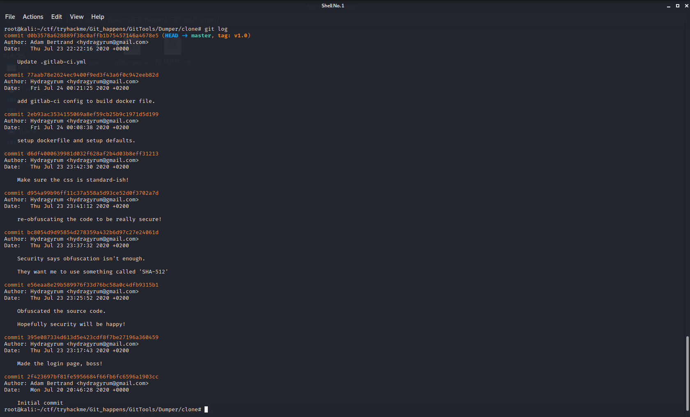

# Git_Happens_walkthrough_tryhackme
git_happen_room_tryhackme

## from nmap we can see that only port 80 is running 

## gobuster doesnot shows any hidden directry
##  SQl injection and XSS in not working in this case we have to found some other information
## even results from burp suit does'nt helping much 

### let see dirb results:
### we found a  /.git repository also using nmap with -sC we can also found the same

### now use <a href="https://github.com/internetwache/GitTools.git/" alt="Git tools">GitTools</a> 
#### now clone this repository the ./sh file ie ./gitdumper.sh in this tool helps you to download .git repository to your local device

## you will find some interesting stuff in the logs 
### try to figure out it.

#### git commands used : git log , git status , git show <commit-id>
  
  

